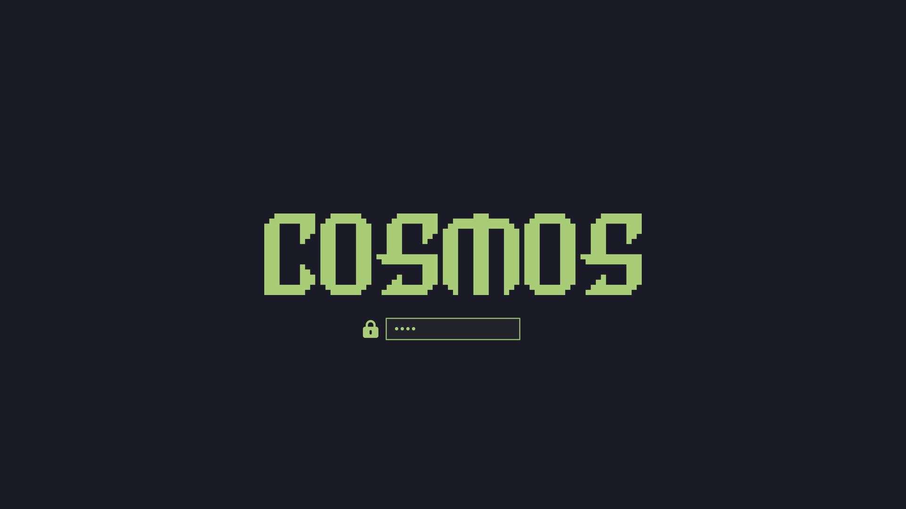

# omarchy-boot-wordmark

Build an Omarchy-style Plymouth boot theme from any word. Renders your word in **Delta Corps Priest 1** — the FIGlet font the Omarchy wordmark itself is drawn in — and rasterizes it to a seamless `logo.png` in your theme's colors. The result plugs into Omarchy's native **Style → Unlock** picker, no system files touched.



## Why not just ImageMagick text?

Two traps everyone hits doing this by hand:

1. **Wrong font.** A smooth sans (DejaVu, Cantarell, …) looks nothing like the stock wordmark. This tool uses Omarchy's own renderer (built-in `omarchy ascii` when your Omarchy provides it, otherwise a vendored copy of the same script with the same embedded font and kerning).
2. **Grid seams.** Rasterizing FIGlet art through a monospace font leaves hairline gaps at every character-cell boundary. This tool paints the FIGlet grid directly as filled rectangles — interiors come out 100% solid, exactly like stock `logo.png` (verified at pixel level).

Cells use classic terminal proportions (twice as tall as wide) with uniform scaling, so letterforms are never squished.

## Install

```bash
git clone https://github.com/zaheen4/omarchy-boot-wordmark.git ~/.local/share/omarchy-boot-wordmark
```

Dependencies (all already required by Omarchy's own `omarchy plymouth` commands, plus Pillow):

```bash
sudo pacman -S --needed imagemagick python-pillow
```

## Usage

```bash
# WORD  BG COLOR  FG COLOR   DESTINATION
./render-wordmark.sh "AURORA" '#1e1e2e' '#89b4fa' ~/.config/omarchy/themes/aurora

# apply it (also recolors SDDM to match, rebuilds initramfs)
omarchy plymouth set by theme aurora
```

Or pick it in the Omarchy menu under **Style → Unlock**. Revert anytime with `omarchy plymouth reset`.

Options:

- `--cell-px N` — fixed cell width in px. By default the word is uniformly scaled to fit the 800×188 canvas; pass a value (e.g. `8.08`) to keep a constant font size across words of different lengths.

Notes:

- The font draws **letters and spaces only** — digits and punctuation are skipped (and named on stderr).
- Rule of thumb: ~8 characters fit the 800px canvas at the default size. Longer words still work but render smaller.
- `examples/cosmos/` contains a demo render so you can see the output before installing anything.

## How it works

1. `omarchy ascii "WORD"` (or the vendored fallback) lays out Delta Corps Priest 1 glyphs with kerning — slid together until they touch, the way the stock wordmark is set.
2. `lib/rasterize.py` maps each text cell to filled rectangles (`█` full, `▄`/`▀` half cells), renders at 4× supersample, downscales to a transparent 800×188 `unlock.png`.
3. The script composites `preview-unlock.png` (1920×1080) with the lock/password entry recolored to your color, mirroring `omarchy-plymouth-preview`, and writes `colors.toml` with your background/foreground.

Everything lives in `~/.config/omarchy/themes/<name>/`, so a system update can never overwrite it.

## Uninstall

```bash
rm -rf ~/.config/omarchy/themes/<name>
omarchy plymouth reset   # only if it was the active theme
```

## Attribution

- `lib/omarchy-ascii-vendor` and `lib/UPSTREAM-LICENSE`: Omarchy's `omarchy-ascii` command, © David Heinemeier Hansson, MIT (basecamp/omarchy). Used verbatim as a fallback for Omarchy installs that predate the built-in `omarchy ascii` command.
- Delta Corps Priest 1 FIGlet font © CoSMiC cHiLD (embedded in the above).
